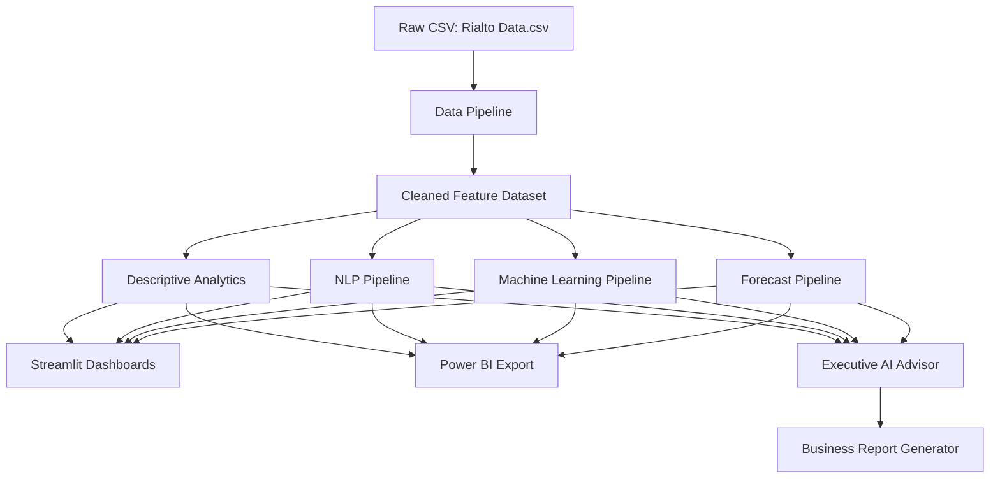
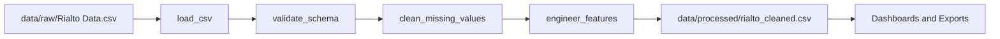
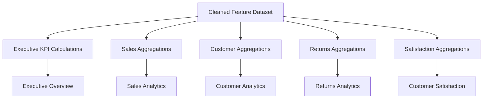
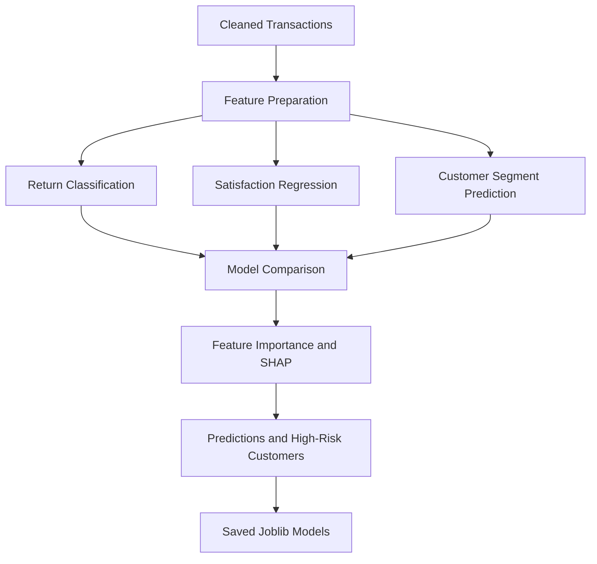
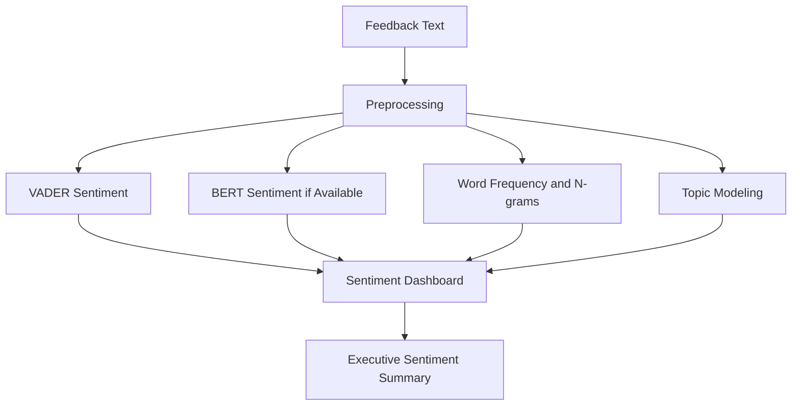
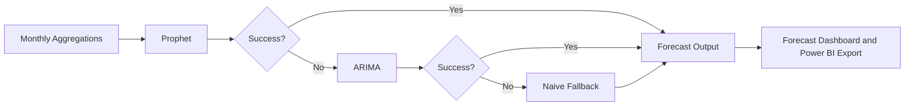
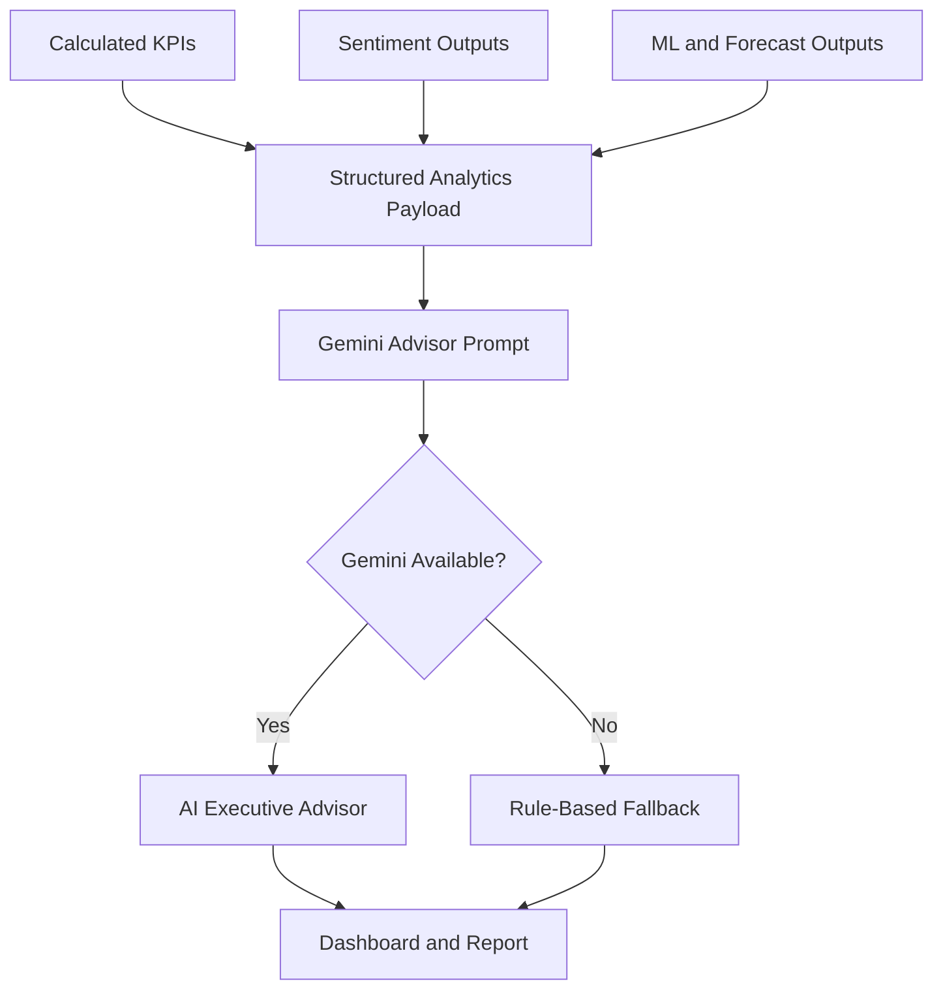
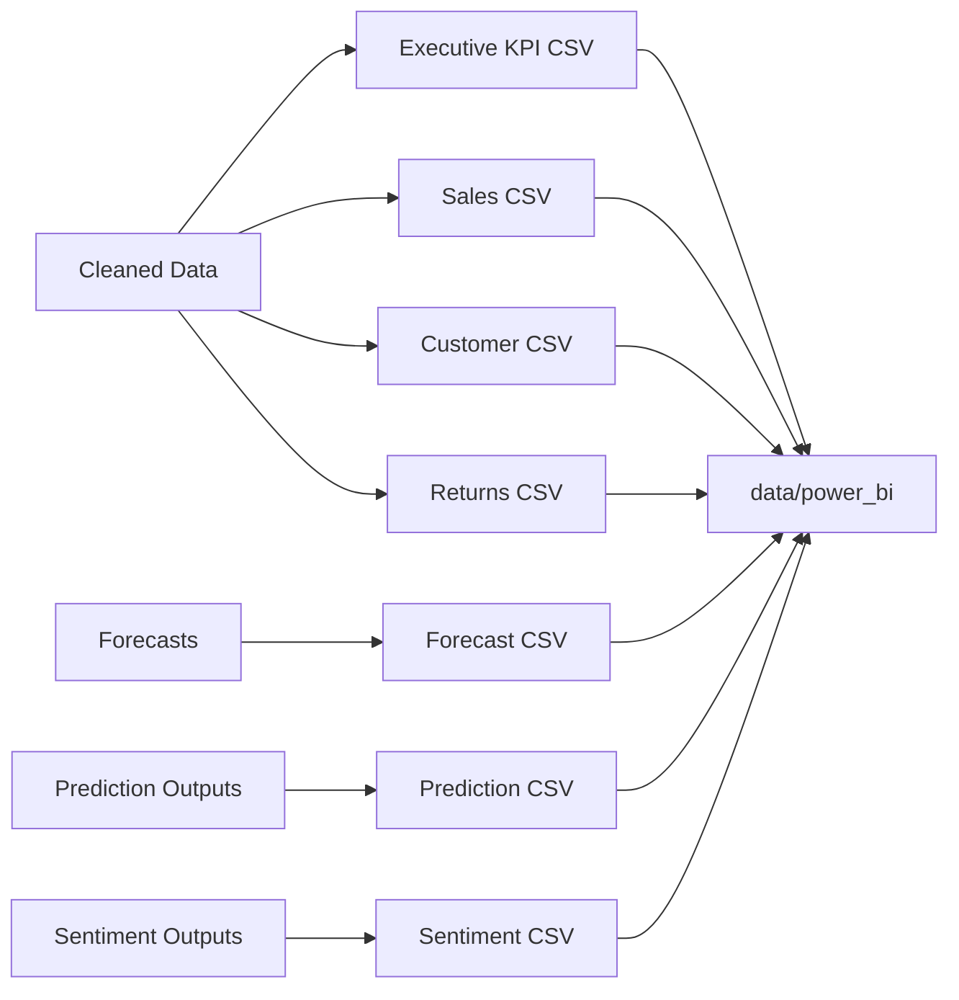

# Architecture

## High-Level Architecture

The platform keeps calculations in `src/` modules and presentation in `app/`. Streamlit pages call reusable pipelines instead of embedding business logic directly in the UI.

## Data Pipeline

Engineered fields include `Month`, `Quarter`, `Year`, `Return_Flag`, `Revenue_Band`, `Feedback_Length`, and `Low_Satisfaction_Flag`.

## Analytics Pipeline

The analytics layer uses reusable Pandas aggregations from `src/analytics.py` and `src/data_pipeline.py`. Dashboard pages render these outputs without changing the calculation rules.

## ML Pipeline

The ML layer compares multiple candidate models and selects the best performer using task-appropriate metrics.

## NLP Pipeline

The NLP pipeline uses automatic fallbacks for unavailable NLTK resources, BERT models, BERTopic, and WordCloud.

## Forecast Pipeline

Forecasts cover revenue, transactions, customer growth, and satisfaction.

## GenAI Pipeline

GenAI is constrained to explanation and recommendation. It is not used for primary analytical calculations.

## Export Pipeline

